# RiskR Component Workflow Diagram

```mermaid
graph TD
    %% External Applications (Top side)
    subgraph Applications["📱 Applications"]
        CLI[CLI Commands]
        Client[Client Applications]
    end
    
    %% Core Services (Center)
    subgraph Services["🏗️ Core Services"]
        Gateway[Gateway Server]
        
        subgraph Workers["🔧 Worker Pattern"]
            Streamer[Streamer Service]
            PolicyWorker[Policy Worker]
        end
        
        PolicyManager[Policy Manager]
    end
    
    %% Rules Engine
    subgraph Rules["⚖️ Rules Engine"]
        InlineRules[Inline Rules]
        StreamingRules[Streaming Rules]
        
        subgraph RuleTypes["Rule Types"]
            OFAC[OFAC Address]
            Jurisdiction[Jurisdiction Block]
            KYCTier[KYC Tier Cap]
            DailyVolume[Daily Volume]
            Structuring[Structuring Detection]
        end
    end
    
    %% Data Layer
    subgraph Data["💾 Data Layer"]
        subgraph Queues["📨 Event Queues"]
            PolicyQueue[Policy Updates]
            TxQueue[Transaction Events]
            DecisionQueue[Decisions]
        end
        State[State Store]
        MemState[In-Memory State]
    end
    
    %% Connections
    Applications --> |gateway| Gateway
    Applications --> |streamer| Streamer
    Applications --> |policy apply| PolicyManager
        
    Gateway --> |HTTP API| Client
    Client --> |decision requests| Gateway
    
    %% Policy Flow
    PolicyManager --> |publishes| PolicyQueue
    PolicyQueue --> |policy updates| PolicyWorker
    PolicyWorker --> |updates rules| InlineRules
    PolicyWorker --> |updates rules| StreamingRules
    
    %% Rules Evaluation
    Gateway --> |loads| InlineRules
    Streamer --> |loads| StreamingRules
    
    InlineRules --> OFAC
    InlineRules --> Jurisdiction
    InlineRules --> KYCTier
    StreamingRules --> DailyVolume
    StreamingRules --> Structuring
    
    %% Event Processing (Worker Pattern)
    Gateway --> |publishes| TxQueue
    TxQueue --> |consumes| Streamer
    Streamer --> |processes with rules| StreamingRules
    
    Gateway --> |provisional decisions| DecisionQueue
    Streamer --> |final decisions| DecisionQueue
    Streamer --> |override decisions| DecisionQueue
    
    %% State Management
    Streamer --> |maintains| State
    State --> MemState
    
    %% Styling
    classDef service fill:#e1f5fe,stroke:#01579b,stroke-width:2px
    classDef storage fill:#f3e5f5,stroke:#4a148c,stroke-width:2px
    classDef external fill:#fff3e0,stroke:#e65100,stroke-width:2px
    classDef rules fill:#e8f5e8,stroke:#1b5e20,stroke-width:2px
    classDef queue fill:#fff3e0,stroke:#ff9800,stroke-width:2px
    classDef worker fill:#e8f5e8,stroke:#2e7d32,stroke-width:2px
    
    class Gateway,PolicyManager service
    class State,MemState storage
    class CLI,Client external
    class InlineRules,StreamingRules,OFAC,Jurisdiction,KYCTier,DailyVolume,Structuring rules
    class PolicyQueue,TxQueue,DecisionQueue queue
    class Streamer,PolicyWorker worker
```

## Component Descriptions

### **Applications**
- **CLI Commands**: Command-line interface for managing the system
- **Client Applications**: External applications making decision requests

### **Core Services**
- **Gateway Server**: HTTP API for real-time decision requests
- **Worker Pattern**: Background services that consume from queues
  - **Streamer Service**: Processes transaction events with streaming rules
  - **Policy Worker**: Handles policy updates and rule reloading
- **Policy Manager**: Handles policy application and distribution

### **Rules Engine**
- **Inline Rules**: Stateless rules for immediate evaluation (OFAC, jurisdiction, KYC tier)
- **Streaming Rules**: Stateful rules requiring historical data (daily volume, structuring)

### **Data Layer**
- **Event Queues**: Separate queues for different event types (Policy Updates, Transaction Events, Decisions)
- **State Store**: Manages rolling transaction data for streaming rules

## Worker Pattern Implementation

### **Queue-Based Processing**
1. **Event Production**: Services publish events to queues
2. **Event Consumption**: Workers consume events from queues
3. **Processing**: Workers apply business logic and rules
4. **State Updates**: Workers maintain state and produce new events

### **Worker Types**
- **Streamer Worker**: Processes transaction events with streaming rules
- **Policy Worker**: Handles policy updates and rule engine reloading

## Data Flow

1. **Policy Application**: CLI applies policies via Policy Queue to Policy Worker
2. **Real-time Decisions**: Gateway evaluates inline rules for immediate responses
3. **Streaming Analysis**: Streamer Worker processes events with stateful rules
4. **Event Publishing**: All decisions published to appropriate queues 